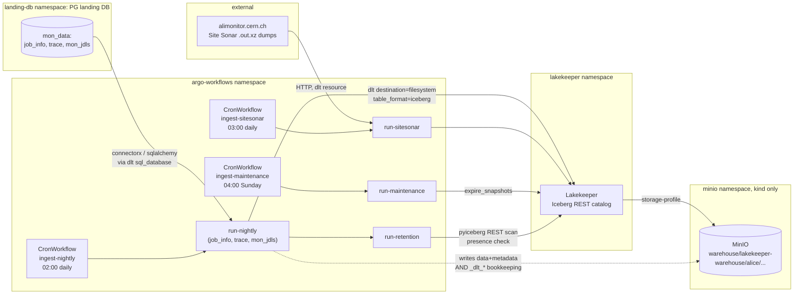

# Runbook: the alice-ingest pipeline

Operator's guide to `ingest/` -- the nightly landing-PostgreSQL -> Apache
Iceberg (Lakekeeper REST) pipeline (Plan 2). Source of truth for everything
below is `ingest/src/alice_ingest/pipeline.py`'s module docstring plus
`retention.py`'s docstring; this runbook restates and organizes that, it
does not supersede it -- if the two ever disagree, the code docstrings win
and this file is stale.

See also: `docs/runbooks/backfill.md` (bounded historical re-runs), the
design doc (`deliverables/2026-07-12-datalake-v2-design.md`, section 4,
"Served data contract").

## 1. Architecture



Every write path (`run-nightly`, `run-sitesonar`) goes through dlt's
`destination="filesystem"` + `table_format="iceberg"` + `[iceberg_catalog]`
REST config pointed at Lakekeeper (`pipeline.py`'s `configure_dlt()`) --
dlt talks to Lakekeeper's REST catalog for table create/commit, and writes
Parquet data files + Iceberg metadata directly to the S3-compatible bucket
Lakekeeper's storage-profile points at (MinIO on kind, Cyfronet S3 in
production -- no MinIO namespace exists on cyfronet, see
`docs/runbooks/bootstrap-cyfronet.md`). `run-retention` and `run-maintenance`
read the catalog directly via `pyiceberg` (no dlt involved on those two
paths).

## 2. Env-var contract

Required (pipeline exits non-zero via `SystemExit` at startup if any are
missing -- `pipeline.py`'s `_REQUIRED_ENV_VARS` / `_check_required_env`):

| Var | Meaning | kind value (hack/kind-up.sh) |
|---|---|---|
| `PG_URL` | landing PostgreSQL connection string (mon-data) | CNPG `mon-data-app` secret's `uri` |
| `S3_ENDPOINT` | S3-compatible endpoint | `http://minio.minio.svc:9000` |
| `S3_ACCESS_KEY` | S3 access key id | `minio-creds` Secret |
| `S3_SECRET_KEY` | S3 secret access key | `minio-creds` Secret |
| `S3_BUCKET` | bucket **+ Lakekeeper storage-profile key-prefix** backing the warehouse -- NOT just the bucket name (see `hack/kind-up.sh`'s "CRITICAL FINDING" comment) | `warehouse/lakekeeper-warehouse` |
| `LAKEKEEPER_URI` | Lakekeeper base URI, no `/catalog` suffix (appended by the code) | `http://lakekeeper.lakekeeper.svc:8181` |
| `LAKEKEEPER_WAREHOUSE` | Lakekeeper warehouse name | `default` |

Optional, with defaults:

| Var | Default | Consumed by |
|---|---|---|
| `S3_REGION` | `local-01` | `pipeline.py`, `retention.py` (any non-empty string satisfies the S3 SDK; MinIO ignores it) |
| `RETENTION_DAYS` | `14` (owner decision 2026-07-12) | `retention.py` |
| `SITESONAR_URL` | `http://alimonitor.cern.ch/download/kalana/` | `sitesonar.py` |
| `SITESONAR_LIMIT` | unset (no limit) | `sitesonar.py`'s `_resolve_limit()` (final-review N5-part) -- caps `run-sitesonar`'s per-run new-file fetch count, same effect as the pre-existing `--limit` CLI flag (which always wins if both are given). **kind-only**: `hack/kind-up.sh`'s `ingest-env` Secret sets `SITESONAR_LIMIT=5` so a scheduled kind tick never attempts the real ~1740-file alimonitor.cern.ch backlog. **Cyfronet deliberately leaves this unset** (`chart/values-cyfronet.yaml`'s `ingest-env` ExternalSecret example has no `SITESONAR_LIMIT` key) -- production must run the real, unbounded backlog drain. |
| `MAINTENANCE_OLDER_THAN_DAYS` | `7` | `maintenance.py` (snapshot-expiry cutoff, distinct from `RETENTION_DAYS`) |
| `TRINO_MAINTENANCE_RETENTION_THRESHOLD` | `7d` | `maintenance.py`'s `run_trino()` (Trino `expire_snapshots`/`remove_orphan_files` retention arg -- `7d` sits exactly at Trino's connector-enforced minimum, see `maintenance.py`'s module docstring, "Retention floor") |
| `MAINTENANCE_FORCE` | unset | `maintenance.py`'s `run_trino()` -- set to `1` to skip the P3T3 review Important 1 nightly-vs-maintenance overlap guard (`check_nightly_overlap_guard()`) and proceed with Trino maintenance regardless of whether `ingest-nightly` is currently Running. An operator's explicit "I know what I'm doing" override for a manual trigger (e.g. after confirming nightly is idle, or accepting the Iceberg-OCC-mediated conflict risk for a one-off run); the guard itself already fails open (proceeds with a warning) if the Kubernetes API is unreachable, so this var is for a KNOWN-running nightly, not a broken guard. |

Backfill overrides, all optional (Plan 2 Task 6; see `docs/runbooks/
backfill.md` for worked examples -- listed here only for the contract):

| Var | Overrides | Format |
|---|---|---|
| `INGEST_INITIAL_JOB_INFO` | job_info's `last_update` incremental cursor start | ISO date/date-time, **naive**, e.g. `2026-03-01` or `2026-03-01T00:00:00` |
| `INGEST_INITIAL_TRACE` | trace's `laststatuschangetimestamp` cursor start | integer, epoch **milliseconds** (same unit as the column) |
| `INGEST_INITIAL_MON_JDLS` | mon_jdls's `job_id` cursor start | integer |

## 3. Running each subcommand manually

The image's `ENTRYPOINT` is `alice-ingest`; every subcommand below is
`alice-ingest <command>` inside a pod with `envFrom: [{secretRef: {name:
ingest-env}}]` under the `pipeline-runner` ServiceAccount, in the
`argo-workflows` namespace -- same shape as `hack/run-ingest-once.sh`
(which does exactly this for `run-nightly`) and `hack/kind-verify.sh`'s
probes. Ad hoc example, `run-sitesonar` bounded to the single most recent
file (the pattern used for its own e2e proof in Task 4):

```bash
IMAGE=$(yq -r '.images.ingest' chart/values.yaml)
kubectl -n argo-workflows create -o name -f - <<EOF
apiVersion: argoproj.io/v1alpha1
kind: Workflow
metadata: {generateName: ingest-manual-}
spec:
  serviceAccountName: pipeline-runner
  entrypoint: main
  ttlStrategy: {secondsAfterCompletion: 3600}
  templates:
    - name: main
      container:
        image: $IMAGE
        envFrom: [{secretRef: {name: ingest-env}}]
        args: ["run-sitesonar", "--limit", "1"]
EOF
```

Poll/logs the same way `hack/run-ingest-once.sh` does (`kubectl get
workflow.argoproj.io/<name> -o jsonpath='{.status.phase}'`, then `kubectl
logs <name> -c main` -- **not** `kubectl logs workflow.argoproj.io/<name>`,
which fails: `kubectl logs` doesn't resolve the Workflow kind, only the pod
Argo names after it).

Commands:

- `run-nightly` -- job_info, trace, mon_jdls (-> `mon_jdls_parsed`), each a
  separate `pipeline.run()` call, merge/upsert write disposition.
- `run-sitesonar [--limit N]` -- Site Sonar HTTP scrape -> `site_sonar`
  table. `--limit N` caps fetching to the N most-recent `.out.xz` files
  (bounded probe use; omit for the real nightly run, which uses the
  file-level high-water mark to skip already-processed archives).
- `run-retention` -- landing-row retention against `RETENTION_DAYS`,
  gated on Iceberg-presence verification (section 5 below).
- `run-maintenance` -- weekly Iceberg snapshot expiry
  (`table.maintenance.expire_snapshots().older_than(...)` for every table
  currently registered under `alice`).

The scheduled `CronWorkflow`s (`chart/templates/ingest-cronworkflows.yaml`)
run these on `.Values.ingest.schedules.{nightly,sitesonar,maintenance}`
(kind/default: `02:00`, `03:00`, Sunday `04:00`); `run-retention` runs as
the second DAG step of `ingest-nightly`, gated on `run-nightly` succeeding
first (hard dependency, not a race).

## 4. Watermark state location

dlt's `destination="filesystem"` persists BOTH the actual Iceberg data and
its OWN pipeline/schema bookkeeping as plain objects directly in the S3
bucket, **entirely outside the Iceberg catalog** -- Lakekeeper/pyiceberg
never see these objects; they are pure dlt-side state. Verified live twice:
first by the Plan 2 Task 5 reviewer (via a `boto3`-based probe against the
running kind cluster), and independently re-verified in this session (Task
6) by listing every object under the prefix with `fsspec`'s `s3`
filesystem from inside a throwaway pod using the pinned ingest image and
the live `ingest-env` Secret. Exact layout observed on kind, bucket
`warehouse`, key-prefix `lakekeeper-warehouse` (i.e. `S3_BUCKET=
warehouse/lakekeeper-warehouse`):

```
s3://warehouse/lakekeeper-warehouse/alice/
  _dlt_loads/            one <schema_name>__<load_id>.jsonl per pipeline.run() call
  _dlt_pipeline_state/   one <pipeline_name>__<load_id>__<schema_hash>.jsonl per run --
                          THIS is the incremental watermark: dlt reads the most
                          recent state file here to resume each table's
                          incremental cursor on the next run
  _dlt_version/          schema-version bookkeeping, one file per schema change
  init                   marker object written on first pipeline init
  job_info/               } real Iceberg table dirs (data/ + metadata/),
  trace/                  } created/committed via the Lakekeeper REST catalog --
  mon_jdls_parsed/        } these ARE visible to pyiceberg/Lakekeeper, unlike
  site_sonar/              } everything above this line
  ...
```

`pipeline_name` is `alice_ingest_nightly` for `run-nightly`'s three
resources (job_info/trace via `sql_database`, mon_jdls via `sql_table`
carries schema name `sql_database` in the `_dlt_loads`/`_dlt_version`
filenames -- both land under the same `alice_ingest_nightly` pipeline
state) and `alice_ingest_sitesonar` for `run-sitesonar`.

**This matters operationally**: dropping the Iceberg tables/namespace via
the catalog API (`purge_table`/`drop_namespace`) does **not** reset the
pipeline -- the next run restores the old schema/watermarks from this
leftover bucket-side state (found the hard way in Plan 2 Task 3; see
section 6, "Reset procedure").

## 5. Failure modes

### 5a. Schema-contract freeze violation

Every table is loaded with `schema_contract={"columns": "evolve", "data_type":
"freeze"}`: new **columns** may appear over time (dlt evolves the Iceberg
schema automatically), but an existing column's **type** is frozen -- a
type change is a hard failure, not a silent coercion.

What it looks like: `pipeline.run()` (inside `run-nightly`'s pod logs)
raises `dlt.common.schema.exceptions.DataValidationError` (or the DAG step
simply shows `Failed`/`Error` in `kubectl -n argo-workflows get workflow
...`), e.g. (real instance hit in Task 3):

```
DataValidationError: ... job_info.job_submit_timestamp frozen as
timestamp/timezone: True from the OLD schema, incoming bigint
```

What to do:

1. Check the pod logs (`kubectl -n argo-workflows logs <pod> -c main`) for
   the exact column + old-vs-new type.
2. Determine whether the SOURCE actually changed type (a real upstream
   schema change -- stop, this needs a design decision, do not paper over
   it) or whether Iceberg is frozen on a STALE type from a previous
   fixture/schema iteration that no longer matches the source (the Task 3
   case: a fixture bug, already fixed at the source).
3. If it's case 2 (stale frozen type, source is now correct and should
   define the schema going forward): run `hack/reset-pipeline.sh` (section
   6) to wipe both the catalog tables/namespace AND the bucket-side dlt
   state, then rerun ingestion so dlt learns the type fresh. **Do not**
   just drop the Iceberg tables and rerun -- section 4 explains why that
   alone doesn't work.
4. If it's case 1 (real upstream type change), this needs a conscious
   migration decision (new column? accept the type change deliberately by
   also resetting?) -- not a routine runbook action, escalate.

### 5b. Retention: `unverified > 0`

`run-retention`'s exit code is non-zero whenever any old landing row was
**kept** because its `job_id` could not be verified present in the
corresponding Iceberg table (`retention.py`'s `exit_code()`) -- this is the
alerting signal `RetentionUnverifiedRows` (Plan 2 Task 5) consumes. The
summary line (grep-friendly, printed on every run regardless of outcome):

```
RETENTION kept=<n> deleted=<n> unverified=<n>
```

with a `RETENTION table=<name> kept=... deleted=... unverified=...` line
per table above it, and a `logger.warning` listing up to 20 of the actual
unverified `job_id`s per table.

Investigation steps:

1. Identify which table(s) have `unverified>0` from the per-table lines.
2. Check whether `run-nightly` has been failing or lagging (`kubectl -n
   argo-workflows get workflow -l workflows.argoproj.io/cron-workflow=
   ingest-nightly`) -- the far more common cause than actual data loss:
   ingestion hasn't caught up yet, so rows genuinely aren't in Iceberg yet.
3. If ingestion is healthy and current, spot-check a specific job_id
   directly: run the same presence-check pattern `retention.py` uses
   (`catalog.load_table(...).scan(row_filter=In("job_id", [...])).to_arrow()`)
   from a throwaway pod (same shape as `hack/kind-verify.sh`'s
   iceberg-contents-probe) to confirm it's genuinely absent.
4. **Never manually force-delete** kept rows. The design intent (D5) is
   that `unverified` rows stay in the landing DB until ingestion actually
   catches up and the next scheduled retention run re-verifies and deletes
   them on its own -- this exit code exists to page a human, not to be
   silenced by hand.

### 5c. `RETENTION ABORT: implausible trace timestamps`

A distinct, harder failure mode than 5b: `check_trace_plausibility()`
sanity-checks the decoded min/max of `trace`'s **candidate** old-row set
(`to_timestamp(laststatuschangetimestamp / 1000.0)`) against
`[2020-01-01, 2035-01-01)` **before any table's delete runs** (not just
`trace`'s -- the whole pass aborts). If it trips:

```
RETENTION ABORT: implausible trace timestamps (min=..., max=...; expected
within [...]) -- refusing to delete N candidate row(s) from `trace`. This
is almost certainly an epoch-unit regression (seconds mistaken for
milliseconds, or vice versa) -- investigate before rerunning retention.
```

This means the `/1000.0` divisor is very likely wrong for the current data
(production reverting to seconds, a fixture/migration regression
reintroducing seconds -- see `hack/seed-fixture.sh`'s own unit-fix history).
**No deletes ran for ANY table on this abort** -- fix the unit mismatch at
its source (fixture or `retention.py`'s divisor, whichever is actually
wrong) before rerunning; do not "fix" this by loosening the plausibility
window.

## 6. Reset procedure

`hack/reset-pipeline.sh` -- wipes the `alice` Iceberg namespace/tables AND
the underlying S3 bucket-side dlt state (section 4) in one step. Use before
a from-scratch backfill, or after resolving a 5a schema-freeze violation
caused by stale frozen types. Does **not** touch the landing PostgreSQL
tables -- reset those separately (on kind, rerun `hack/seed-fixture.sh`,
which `TRUNCATE`s and re-seeds deterministically; note its `CREATE TABLE IF
NOT EXISTS` does not migrate an existing table's columns, so drop the PG
tables first if the fixture's schema itself changed).

This is a destructive operation: **always check your kubectl context before running.** The script guards against accidental execution on non-kind clusters by requiring the `--yes` flag and refusing non-kind contexts unless `--force-context` is added. The guard prevents catastrophic data loss on production or long-running test clusters.

```bash
# On kind: requires explicit --yes
hack/reset-pipeline.sh --yes

# On a non-kind cluster (only if you are sure): add --force-context
hack/reset-pipeline.sh --yes --force-context
```

Idempotent and safe to rerun: reports `0 table(s)` / `namespace ... already
absent` / `0 object(s)` if there's nothing left to wipe.

## 7. Idempotency guarantees

**`job_info`, `trace`, and `mon_jdls_parsed`** use
`write_disposition={"disposition": "merge", "strategy": "upsert"}` on
`primary_key="job_id"`. A rerun over already-loaded data is a genuine
no-op at the data level for these three: verified live in Task 3 by
running `hack/run-ingest-once.sh` twice back to back against the same
fixture state -- identical row counts, identical distinct-job_id counts
(no duplicates), and **identical Iceberg snapshot IDs** on the second run
(dlt logs "0 load package(s) ... into dataset None" for a resource whose
incremental cursor found nothing new, and a 0-row merge commits no new
snapshot). This is what makes `docs/runbooks/backfill.md`'s bounded-window
re-run procedure safe for these tables: re-running a window that overlaps
already-ingested data never duplicates or corrupts existing rows.

**`site_sonar` is the one exception** (final-review N4 -- this section
previously and incorrectly claimed "every table" uses merge/upsert;
`sitesonar.py`'s `build_site_sonar_resource()` sets
`write_disposition="append"`, not merge). Its idempotency guarantee is
weaker and works differently:

- Row-level: dlt's incremental cursor on `last_updated` makes a rerun over
  the SAME already-fetched file idempotent in the ordinary case (the
  cursor has already advanced past those rows, so a repeat pass over the
  same file yields nothing new to append).
- File-level: the real dedup mechanism is `sitesonar.py`'s high-water-mark
  file skip (`select_files_to_fetch()`/`_iter_rows()`, this doc's section
  1) -- once a `.out.xz` file's epoch is at or below the persisted
  `high_water_mark`, the file is never re-downloaded or re-parsed at all
  on a later run.
- **Weaker crash-retry semantics than the merge/upsert tables**: because
  the write disposition is `append`, not `merge`, a crash or restart
  between an APPEND actually committing to Iceberg and the pipeline
  successfully persisting its own updated `_dlt_pipeline_state` (section
  4) can leave the high-water mark stale relative to what was actually
  written. The NEXT run then re-fetches and re-appends the same file(s) --
  genuine duplicate rows in `site_sonar`, not merged away, since there is
  no upsert key deduplicating on rerun (unlike `job_info`/`trace`/
  `mon_jdls_parsed`, where a duplicate re-ingest of the same `job_id`
  silently upserts in place). This window is narrow (state persist happens
  immediately after a successful `pipeline.run()` call) but real; a
  consumer of `site_sonar` that cannot tolerate occasional duplicate
  `(hostname, last_updated)` rows across a crash-retry boundary should
  dedupe on read, not assume append-only means duplicate-free.
